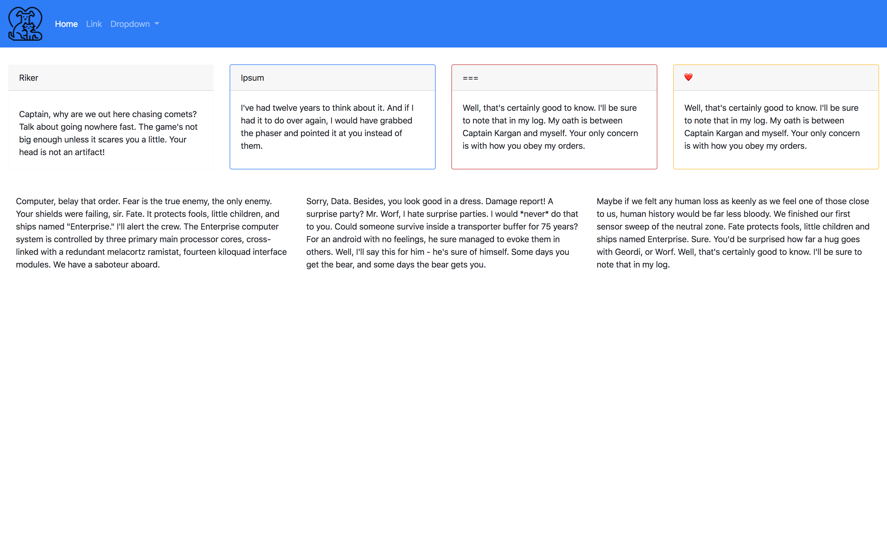

# suplemental Bootstrap Assignmnet
Create a mobile-responsive website using Bootstrap5 which reflects what is seen here in the mockup pictures. Only use CSS if you've exhausted all Bootstrap resources.
## Desktop View  

## Mobile View 1  

## Mobile View 2  

## Mobile View 3  

